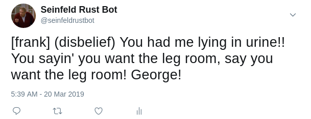

# seinbot-rs

[](https://crates.io/crates/seinbot-rs) [](https://twitter.com/seinfeldrustbot)

A seinfeld twitter bot using aws lambda functions and markov chains in rust.

## Introduction

[](https://twitter.com/seinfeldrustbot/status/1108347279012970498)
> _Example tweet from frank costanza_

I've always wanted to make a robot that contributes to the [heat death](https://en.wikipedia.org/wiki/Heat_death_of_the_universe) of the universe through asinine tweets. This is the result! 

Primarily for learning purposes, the intent of this project was to see how easy it would be to:
1. Use [markov chains](https://en.wikipedia.org/wiki/Markov_chain) to generate pseudo random text based on the hit TV series [Seinfeld](https://en.wikipedia.org/wiki/Seinfeld).
2. Publish generated content to the internet.
3. Automate content generation and publishing so it would occur on a daily basis.
4. ... and do it all in _**Rust!**_

## Results

Thankfully, there were a number of well-documented Rust libraries that made implemention of this project quite simple. Using [AWS Lambda](https://aws.amazon.com/lambda) functions and the [serverless application framework](https://serverless.com) for Rust, it was trivial to deploy and configure the code to run periodically:

```yaml
service: daily-tweet
provider:
  name: aws
  runtime: rust
...
functions:
  seinbot:
    handler: seinbot-rs
    events:
      - schedule: rate(24 hours)
```
> _Snippet from serverless.yml (used to deploy to AWS)_

Whilst the bot mostly produces nonsensical output, it can sometimes construct something quite amusing (see above tweet). Overall, I am quite happy with final product and would like to thank the following projects that made it so:

* [seinfeld-scripts](https://github.com/colinpollock/seinfeld-scripts): For providing the database of seinfeld content used in the markov chain.
* [markov](https://github.com/aatxe/markov): For providing a Rust implementation of markov chains.
* [egg_mode](https://github.com/QuietMisdreavus/twitter-rs): For providing the library used to interact with Twitter's API.
* [aws-lambda-rust-runtime](https://github.com/awslabs/aws-lambda-rust-runtime): For providing the library used to implement an AWS Lambda function in Rust.
* [serverless-rust](https://github.com/softprops/serverless-rust): For providing the framework used to configure, test, and deploy the bot.


